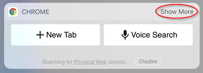

# ng-beacon-hunt

Welcome to the ng-beacon hunt game! 

The goal of the game is to find all the ng-beacons in the conference venue, interact with them to get clues and solve puzzles. There are also awesome prizes: A ticket to ng-cruise, ng-beacon and a MiP robot. So what are you waiting for? Let's gets started!

## What are ng-beacons?

Ng-beacons are Bluetooth Low Energy hardware devices which look like the Angular logo we all love. Internally, they run a small embedded JavaScript engine called [Espruino](espruino.com). You can learn more about these beacons and why I created them in [this blog post](https://medium.com/@urish/introducing-ng-beacons-344d79370593#.x6uhqakpg).

## Step 1 - Physical Web

Find the ng-beacon - it is in the food room. The beacon broadcasts a URL which you can receive using the [Physical Web](https://medium.com/@urish/exploring-the-physical-web-without-buying-beacons-efae51e36c2e). If you don't know how to receive these URLs don't worry - just follow the instructions below:

### Android Users

First of all, make sure you have a working Internet connection (either Cellular or WiFi are good). 

Then, make sure you enable Bluetooth and Location, as both are required to receive Physical Web URLs. After enabling them, lock and unlock your screen, and open the notification bar. You should see a notification similar to this one:

Then, opt-in to start receiving Physical Web notifications. Don't worry - these notifications are not intrusive, they don't make any sound and only appear when you open your notification drawer.

If you don't get the notification, go to your Android Device Settings and select the "Google" item in the settings menu. Then, choose "Nearby". You should see the link popping up there.

Alternatively, you can open your Chrome browser, go to *Settings*, then *Privacy*, and at the bottom of the page, click on the *Physical Web* item, then click on the blue *See What's Nearby* button. This should scan for Physical Web pages around you, and show you the link. 

### iOS Users

First of all, make sure Bluetooth is on:

Then install [Chrome for iOS](https://itunes.apple.com/us/app/google-chrome-the-fast-and-secure-web-browser/id535886823?mt=8) on your device, and add the Chrome widget to the *Today* tab of your notification center by clicking the *Edit* button at the bottom of the page:

Add the Chrome widget by clicking the green circle with the plus sign next to it:

Finally, go back to the *Today* tab and enable the Physical web notifications by clicking the *Show more* button:

Then clicking *OK, Got it*:

That's it! The Physical Web URL should appear in about 5 seconds.
